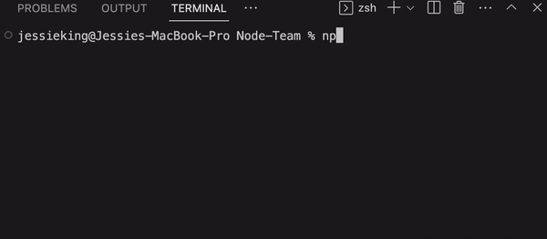

<h1 align="center">Node: Team-Generator 👥</h1>

## 📑 Description:

This command-line application leverages inquirer prompts to gather input from the user. The application collects information about employees in a software engineering team and generates an HTML webpage with a summary for each employee.

<br>


## ⚙️ **Installation:**
The purpose of Inquirer.js is to provide a command-line interface for Node.js that is high quality and simple to integrate.

<br>

**Requirements:**
* [Javascript](https://www.javascript.com/)
* [Node.js](http://nodejs.org)
* [Inquirer.js](https://github.com/inquirer/inquirer.js)
* [Jest](https://marketplace.visualstudio.com/items?itemName=Orta.vscode-jest)

 ```
# npm install inquirer:
npm install inquirer@^8.0.0
```


The application will be invoked by using the following command:

```bash
node index.js
```
<br>

## 🧰 Usage:
Through a command-line interface, this application enables you to quickly and easily generate a Team-Generator HTML file. 

<br>

## 🧪 Test:

- [x] Understanding Test-driven development (TDD)
- [x] Unit Testing
- [x] Jest

When the below command is executed, the test runner specified in the project's testing file will execute all the Jest tests and output the results to the console.

```bash
npm run test
```

***Demo:***



## 🔀 ***Deployment:*** 
Live Link: https://kingjessie.github.io/Team-Generator/

<br>

## 🧑‍🏫 **What I Learnt:**
- [x] Identify and implement prototypal inheritance in JavaScript.
- [x] Create constructor functions to instantiate multiple objects of similar type.
- [x] Ensure code functionality using test-driven development

<br>


## 📚 Resources:
- **Inquirer package** - https://www.npmjs.com/package/inquirer
- **SBoudrias** - https://github.com/SBoudrias/Inquirer.js/blob/master/README.md

<br>

## 🏷️ License
[](https://opensource.org/licenses/MIT)

**MIT License**

***Copyright (c) 2023 KingJessie***

<sub>Permission is hereby granted, free of charge, to any person obtaining a copy of this software and associated documentation files (the "Software"), to deal in the Software without restriction, including without limitation the rights to use, copy, modify, merge, publish, distribute, sublicense, and/or sell copies of the Software, and to permit persons to whom the Software is furnished to do so, subject to the following conditions:</sub>

<sub>The above copyright notice and this permission notice shall be included in all copies or substantial portions of the Software.</sub>

<sub>THE SOFTWARE IS PROVIDED "AS IS", WITHOUT WARRANTY OF ANY KIND, EXPRESS OR IMPLIED, INCLUDING BUT NOT LIMITED TO THE WARRANTIES OF MERCHANTABILITY, FITNESS FOR A PARTICULAR PURPOSE AND NONINFRINGEMENT. IN NO EVENT SHALL THE AUTHORS OR COPYRIGHT HOLDERS BE LIABLE FOR ANY CLAIM, DAMAGES OR OTHER LIABILITY, WHETHER IN AN ACTION OF CONTRACT, TORT OR OTHERWISE, ARISING FROM, OUT OF OR IN CONNECTION WITH THE SOFTWARE OR THE USE OR OTHER DEALINGS IN THE SOFTWARE.</sub>

<br>
